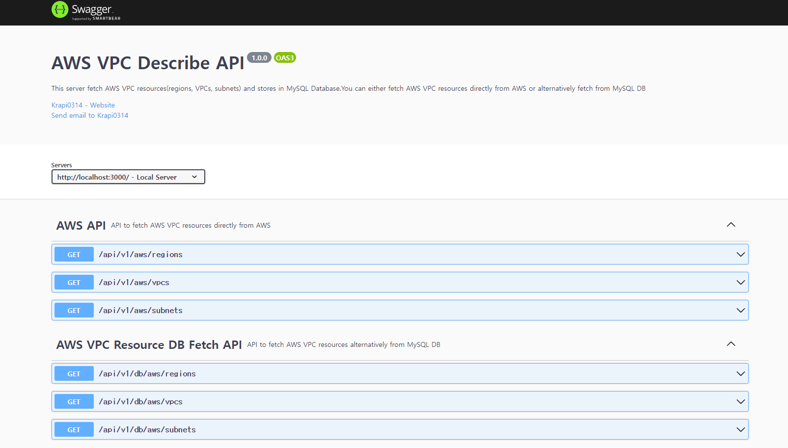

# AWS-VPC-Describer

Node.js Express Server with Swagger UI for fetching AWS VPC resources(regions, VPCs, subnets) and storing in MySQL Database.



## Table of Contents

- Getting Started
  - Prerequisites
  - Instructions
- Development
  - Project Requirements
  - Project Structure
  - References

## Getting Started

Just clone this repository and follow instructions bellow!

### Prerequisites

- `node.js` for JavaScript runtime
- `yarn` or `npm` for client package manager
- `AWS Credentials` for AWS SDK usage (For more information, see:
  - https://docs.aws.amazon.com/sdk-for-javascript/v3/developer-guide/loading-node-credentials-shared.html)

### Instructions

```bash
# clone repository
git clone https://github.com/Krapi0314/AWS-VPC-Describer.git

# change to project directory
cd AWS-VPC-Describer

# create a .env file by copying and adjusting env.example
cp env.example .env

# install dependencies using npm
npm install

# map prisma data model to the mysql database schema
npx prisma migrate dev --name init

# start server (nodemon)
npm start

# enter Swagger URL and check AWS VPC APIs and Schemas!
http://localhost:3000/api/v1/aws/api-docs
```

## Development

### Project Components

- `Express` for project base framework
  - For more information, see: http://expressjs.com/)
- `AWS-SDK` for fetching AWS resources using JavaScript
  - For more information, see: https://aws.amazon.com/sdk-for-javascript/)
- `Prisma` for Node.js <-> Database ORM
  - For more information, see: https://www.prisma.io/)
- `Swagger` for API documentation & testing
  - For more information, see: https://swagger.io/)

### Project Structure

**Client**

- `controller`: API controllers for fetching/serving AWS VPC resources
- `primsa`
  - `schema.prisma`: Model for AWS VPC resources, this corresponds with MySQL tables
- `routes`: Router for routing APIs with Express
- `service`: Service for MySQL CRUD operation on AWS VPC resources
- `server.js`: Main entry point, Exprses/Swagger/CORS configuration

### Refences

**AWS SDK JavaScript v3**

- `Describe Region API`: https://docs.aws.amazon.com/AWSJavaScriptSDK/v3/latest/clients/client-ec2/classes/describeregionscommand.html
- `Describe Vpc API`: https://docs.aws.amazon.com/AWSJavaScriptSDK/v3/latest/clients/client-ec2/classes/describevpcscommand.html
- `Describe Subnet API`: https://docs.aws.amazon.com/AWSJavaScriptSDK/v3/latest/clients/client-ec2/classes/describesubnetscommand.html

**AWS VPC Resources schema**

- `Region`: https://docs.aws.amazon.com/AWSJavaScriptSDK/v3/latest/clients/client-ec2/interfaces/region.html
- `Vpc`: https://docs.aws.amazon.com/AWSJavaScriptSDK/v3/latest/clients/client-ec2/interfaces/vpc.html
- `Subnet`: https://docs.aws.amazon.com/AWSJavaScriptSDK/v3/latest/clients/client-ec2/interfaces/subnet.html
